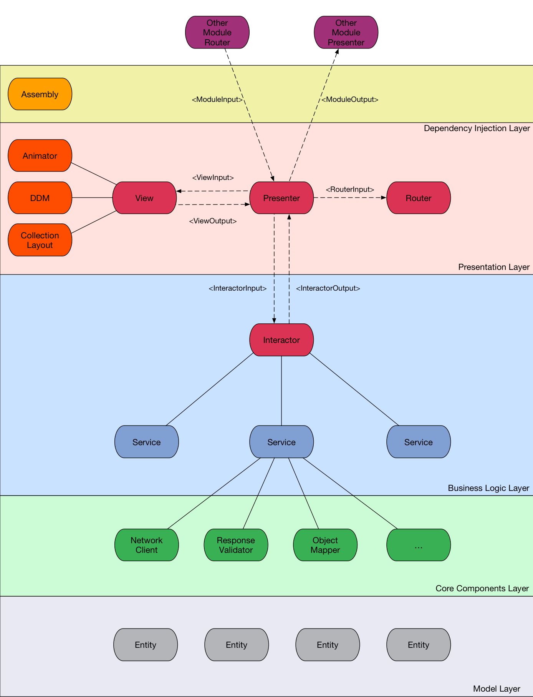

##Разбиение приложения на модули

Любой проект можно разбить на несколько логических частей с четко определенной функциональностью. Возьмем, к примеру, Instagram. Основная часть приложения - лента новостей, в которой мы можем просматривать фотографии, ставить лайки, переходить к экрану создания комментария или к отправке сообщений. На другой вкладке находится список лайков, из которого мы можем переходить к конкретной фотографии. Каждый из этих экранов является самодостаточным элементом приложения, выполняющим четко поставленную задачу, и умеющим при необходимости инициировать переход на другие экраны. Такие элементы приложения мы будем называть модулями.

В простых случаях один экран соответствует одному модулю, но могут быть и сложные экраны, на которых одновременно находятся несколько модулей. Пример из того же Instagram - экран профиля. На нем можно выделить модуль фотографий (1), модуль информации о пользователе (2), вкладки для переключения списка фотографий на другие модули (3).

##Структура VIPER-модуля

Для того, чтобы модуль выполнял свое предназначение, нужно решить ряд задач. Требуется реализовать бизнес-логику модуля, работу с сетью, базой данных, отрисовать пользовательский интерфейс. За все это должны отвечать отдельные компоненты, и VIPER описывает роль каждого компонента и способы их взаимодействия между собой. Итак, VIPER-модуль состоит из следующих частей:

**View:** отвечает за отображение данных на экране и оповещает Presenter о действиях пользователя. Пассивен, сам никогда не запрашивает данные, только получает их от презентера.

**Interactor:** содержит всю бизнес-логику, необходимую для работы текущего модуля.

**Presenter:** получает от **View** информацию о действиях пользователя и преображает ее в запросы к **Router’у**, **Interactor’у**, а также получает данные от **Interactor’a**, подготавливает их и отправляет **View** для отображения.

**Entity**: объекты модели, не содержащие никакой бизнес-логики.

**Router**: отвечает за навигацию между модулями.

##Что мы изменили

Так VIPER выглядит в своем первозданном виде [от Mutual Mobile](https://www.objc.io/issues/13-architecture/viper/). Мы поработали с этим подходом и вскоре поняли, что в нем есть несколько не слишком удобных моментов:

1) В первоначальной версии VIPER за роутинг отвечает компонент под названием Wireframe. Но при этом он же отвечает за сборку модуля, переход к которому он осуществляет, и проставление всех зависимостей у этого модуля. Это плохо, поскольку нарушает принцип [Single Responsibility](https://en.wikipedia.org/wiki/Single_responsibility_principle). 

Мы решили разделить Wireframe на две части. Первая, Router, отвечает только за переходы между модулями. Вторая, Assembly, отвечает за сборку модуля и проставление зависимостей между всеми его компонентами. В наших проектах для этого используется [Typhoon](https://github.com/appsquickly/Typhoon), замечательная библиотека для Dependency Injection, и вручную Assembly из кода даже не вызывается.

2) Интеракторы скрывают в себе бизнес-логику. Звучит довольно страшно, ведь за этим кроется много работы, которую стоит разделять между специализированными классами. К тому же часто один и тот же код нужно переиспользовать в нескольких интеракторах. Нам было нужно общее понимание того, как это делать, чтобы не изобретать свои велосипеды в каждом проекте.

Мы решили ввести дополнительный слой сервисов. Сервис - объект, отвечающий за работу со своим определенным типом модельных объектов. Например, сервис новостей отвечает за получение списка новостей в определенной категории, а так же подробной информации о каждой новости. Сервис авторизации отвечает за, собственно, авторизацию, восстановление пароля, обновление сессии и так далее. У сервисов, в свою очередь, есть зависимости на объекты нижнего уровня, отвечающие за работу с сетью или базой данных.

Сервисы инжектируются в интерактор. В итоге интерактор в основном служит фасадом, взаимодействующим с сервисами и передающим полученные от них данные презентеру. Мы в команде договорились о том, что при работе с Core Data NSManagedObject’ы не выходят на уровни выше интерактора. Поэтому в интеракторах также происходит преобразование NSManagedObject в Plain Old NSObject, то есть простой наследник NSObject.

3) В модуле VIPER в качестве View чаще всего выступает UIViewController. А в контроллере иногда содержится код, не относящийся напрямую к задачам View. Пример: работа с таблицами и коллекциями. Не зря ведь для работы с этими объектами созданы протоколы, подразумевается, что их реализация должна быть вынесена в отдельный объект. Но в примере от Mutual Mobile код по работе с таблицами содержится прямо в UIViewController.

Нам это не понравилось, и мы решили, что View в общем случае является не одним объектом, а слоем. Помимо контроллера этот слой может содержать дополнительные объекты, которые инжектируются в контроллер и берут на себя часть его работы. Примером такого объекта в наших проектах является DataDisplayManager, реализующий методы UITableViewDatasource и UITableViewDelegate, или их аналоги для коллекций.

4) Вопрос передачи данных между модулями в оригинальном VIPER не охвачен. Наше решение этой проблемы описано в главе “Переходы между модулями”, подробно на нем останавливаться не будем. Скажем лишь, что у каждого модуля могут быть интерфейсы входа и выхода - протоколы ModuleInput и ModuleOutput. Первый отвечает за передачу входных данных, например идентификатора статьи для экрана, отвечающего за отображение статьи. Второй отвечает за передачу результата работы модуля заинтересованному объекту. Например, при работе с модулем настроек мы можем передать наружу пункт меню, выбранный пользователем. 

##Итоговая схема модуля

Для иллюстрации всего описанного выше предлагаем ознакомиться с итоговой схемой модуля VIPER. Пугаться не стоит, далеко не каждый модуль должен содержать такое количество объектов. Целью этой схемы было максимально полно отобразить наш подход к архитектуре на примере сложного модуля.

