## Простой vs Сложный модуль

Когда мы начинали использовать VIPER в своей работе, использовалась концепция "Один экран - один модуль". Это прекрасно работало, потому что экраны в основном представляли собой простые таблицы. Но с появлением первого "сложного" экрана начались проблемы.

## Примеры сложных модулей из почты - экран настроек и просмотр письма
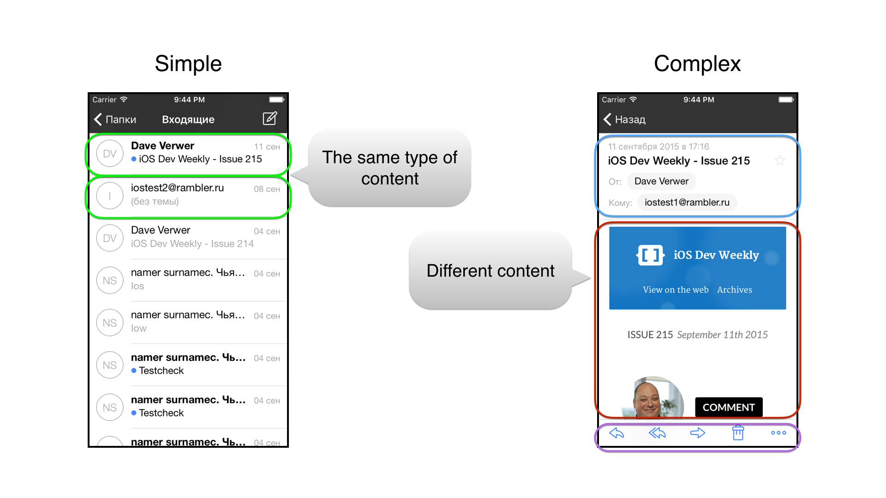
Сложные экраны бывают разными. Например, экран настроек управляет множеством не связанных между собой элементов.
Экран просмотра сообщения внутри себя содержит шапку, коллекции для контактов, вложений, а также просмотр письма, для которого необходимо применить специальные преобразования.

## Проблемы сложных модулей
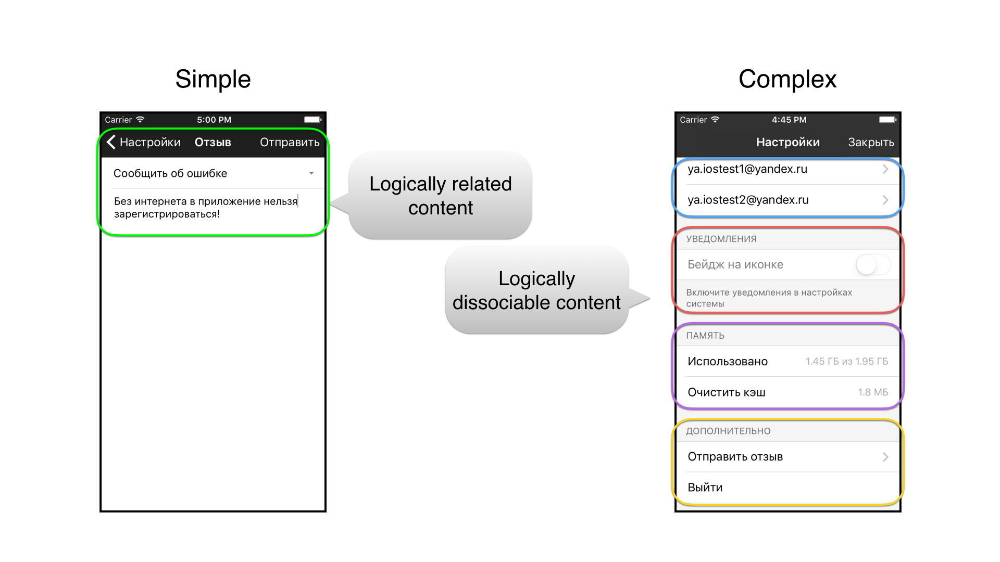
Какие проблемы создают сложные модули?
- Разнородные данные в одном модуле
- Сложная логика работы
- Затруднено тестирование
- Невозможность переиспользования
- Затруднено изменение функций и конфигурации

Например модуль настроек: он должен хранить информацию об имени с подписью, список подключенных ящиков, статус уведомлений. Каждая секция настроек может влиять на своих соседей по секции, но, теоретически, не должна трогать остальные. Хотя такая возможность у неё есть. Переиспользовать такой модуль не получится, все заточено под опции конкретного приложения. Добавление или изменение настроек требует изучения работы всего модуля.

## Разбиение настроек и просмотра письма на подмодули
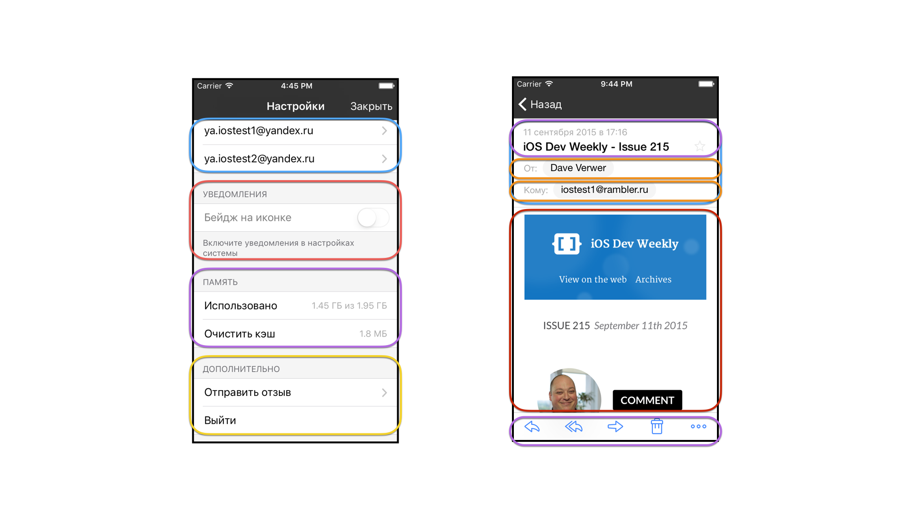
Достаточно очевидное разбиение настроек на подмодули - по секциям. Это логично и наглядно. Первый модуль - данные пользователя, второй модуль - список подключенных ящиков и так далее.

С модулем просмотра сообщения все тоже достаточно просто - шапка, контакты, вложения (а они ещё и сворачиваются) и просмотр тела письма.

## Подмодули: плюсы и минусы

### Плюсы подмодулей:
- Единая ответственность - каждый модуль может, а в идеале даже должен, отвечать за какую-то одну функцию.
- Тестируемость - маленькие модули легче тестировать.
- Переиспользуемость - модуль контактов или вложений может использоваться на экранах написания письма и даже в другом приложении, например мессенджере.
- Для добавления новой функции можно добавить новый подмодуль.
- Возможность создавать разные конфигурации, например добавить дополнительный пункт настроек только для разработчиков.

### Минусы:
- Дополнительный код. Он обеспечивает инициализацию и согласованную работу подмодулей. Его требуется хорошо протестировать.
- Опасность избыточного разделения. Система, разбитая на слишком маленькие модули, рассыпается. К примеру, в настройках не стоит делать модуль для каждого пункта.
- Усложнение потоков данных. Если подмодуль подмодуля должен вернуть какие-то данные в основной модуль, цепочка вызовов будет выглядеть гораздо сложнее, чем в случае монолитного модуля.

Поэтому разбиение на подмодули требует хорошего анализа.

## Варианты разделения сложных модулей на подмодули - обзор
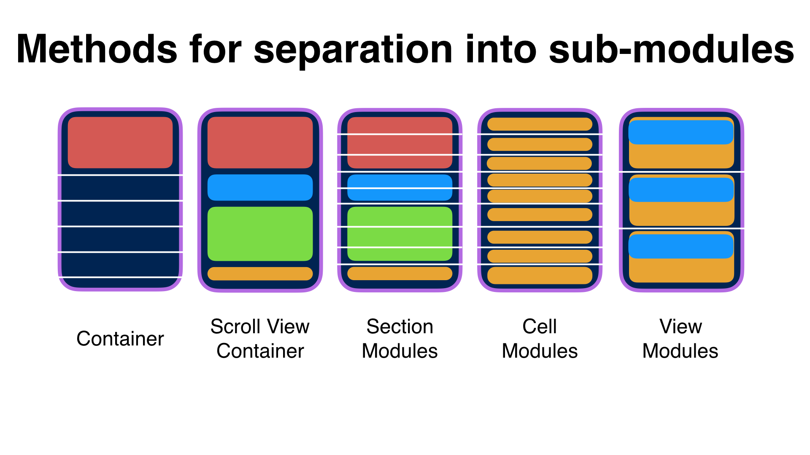
В работе над проектами были использованы 4 варианта композитных модуля:
- Модуль-контейнер
- Scroll View Container
- Таблица с группами ячеек
- Таблица с ячейками-модулями
- Модуль-View

Рассмотрим их подробнее

## Модуль-контейнер
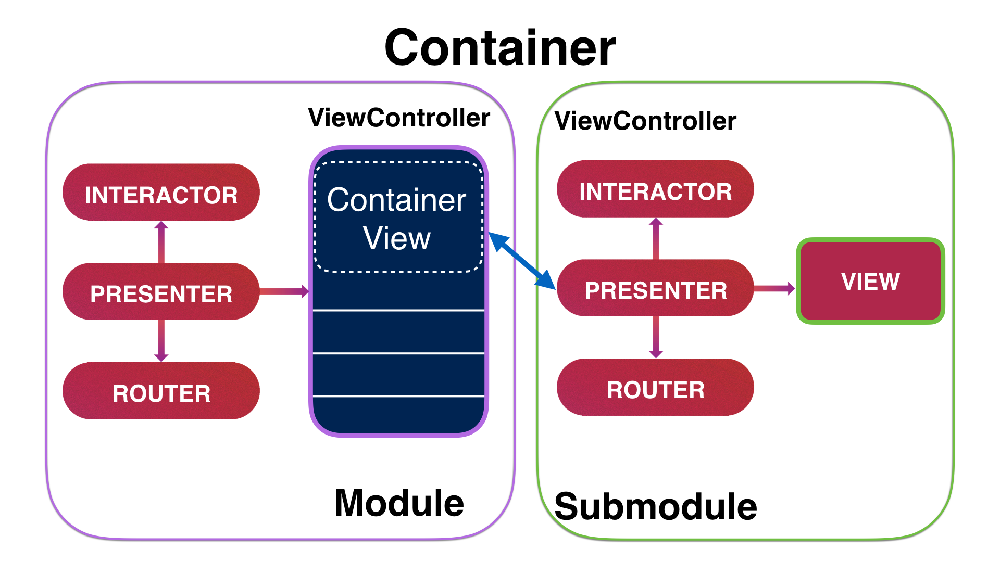
Это аналог Container и EmbedSegue, но управляемый из модуля. Презентер просит роутер добавить дочерний модуль. Роутер инициализирует дочерний модуль, отдает ему данные для работы, добавляет ViewController подмодуля как дочерний для контроллера модуля. И аналогично View контроллера подмодуля добавляется во View-контейнер контроллера модуля.

Такой подход хорошо использовать, когда требуется отдельная логика работы внутри модуля, например для таблиц, у которых есть сложная шапка.

## Модуль-контейнер - пример
Представьте список постов пользователя, над ними шапка с аватаркой и возможностью написать ему сообщение.
Весь модуль постов занимается только постами, он их загружает, отображает и обрабатывает нажание на ячейку поста с переходом на просмотр поста. Если сюда добавить ещё и загрузку профиля с переходом на написание сообщения, модуль заметно усложнится, поэтому их удобно вынести в отдельный встраиваемый подмодуль. Для работы ему требуется только идентификатор пользователя.

## Scroll View Controller
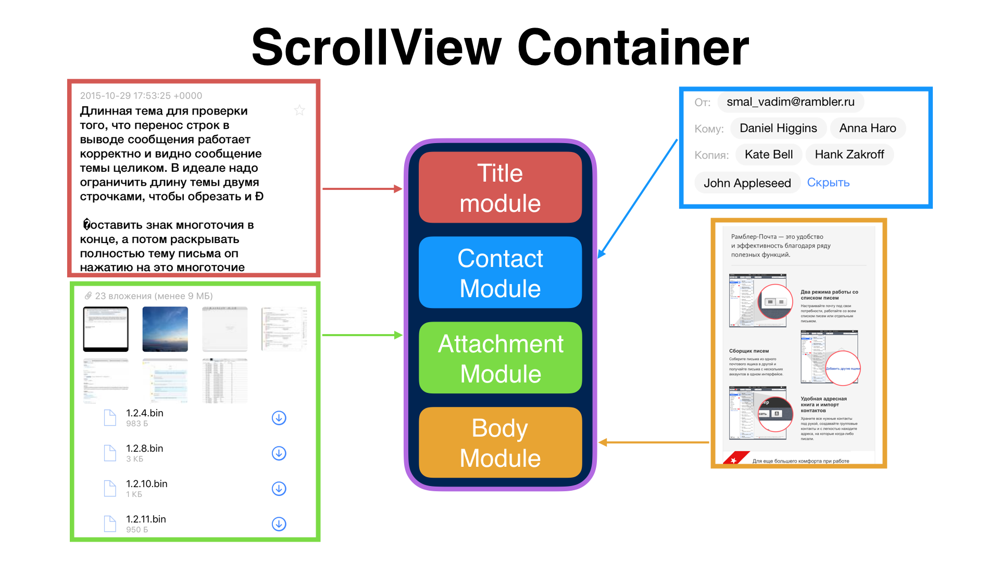
Сложный случай модуля-контейнера. Так реализован экран просмотра сообщений в почтовом клиенте Рамблер/почта. Внутри Scroll View находится несколько контейнеров, каждый из них независимо управляется своим подмодулем. Модуль контактов работает только с загрузкой и отображением контактов, отвечает за сокрытие/разворачивание списка. Модуль вложений разделяет вложения на картинки и документы, отвечает за скрытие и разворачивание списка. Модуль отображения сообщения обрабатывает письма, добавляет переносы в длинные строки, загружает и кеширует inline вложения с картинками.

Причем, как и положено в VIPER, все связанное с загрузкой, обработкой и бизнес-логикой выполяют интеракторы подмодулей. Для этого у них есть ссылки на сервисы. Технически, каждый такой подмодуль можно развернуть на весь экран.

## Таблица с группами ячеек
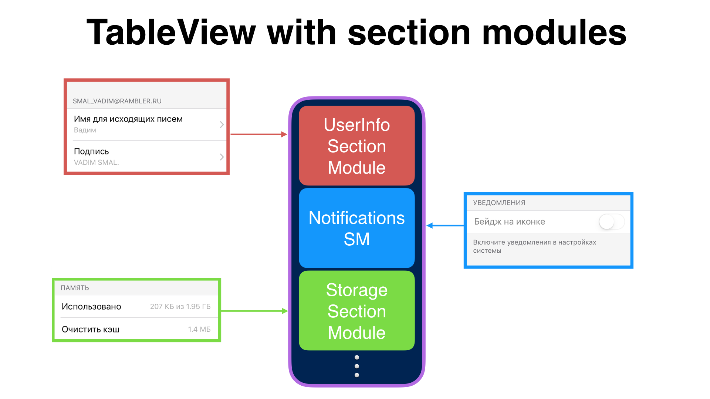
Это способ построения таблицы настроек. Интерактору при инициализации отдается список подмодулей для отображения. Он опрашивает каждый подмодуль и асинхронно получает массив view-model для каждого подмодуля, склеивает их в общий массив и передает своей таблице для отображения. Фабрика ячеек из cell-model получает все необходимые данные для создания и конфигурации ячейки, поэтому универсальна для всех подмодулей.

У подмодулей в качестве View используются фабрики cell-model, они преобразуют данные от presenter в подходящий для отображения в виде ячеек вид, транслируют события из ячеек в presenter, то есть полностью выполняют всю работу View.

Это позволяет модулю уведомлений работать только с уведомлениями, а модулю подключенных ящиков загрузить список ящиков из своего сервиса для отображения.

## Таблица с ячейками-модулями
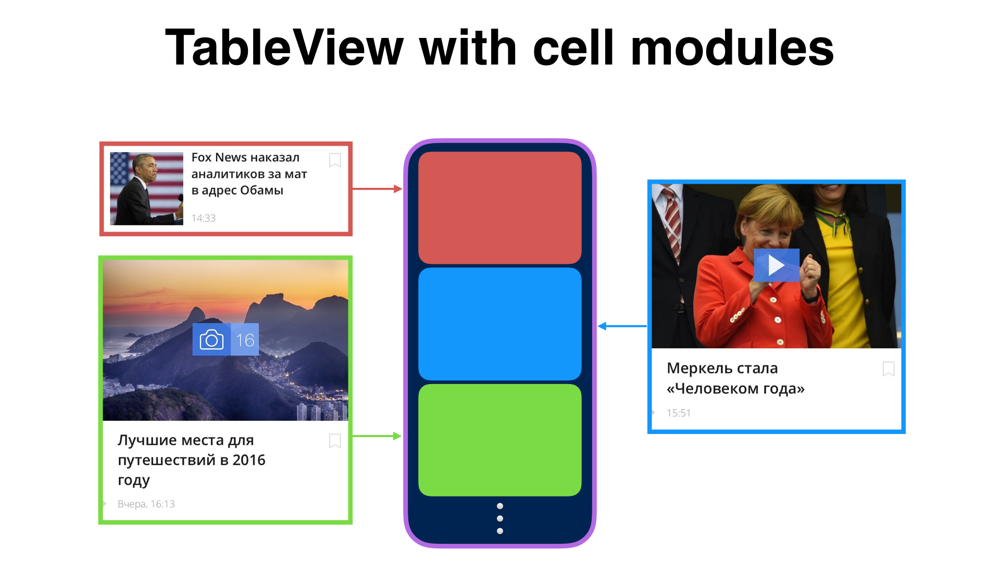
Бывают ситуации, когда отображаемый в таблице контент очень сложный, в ячейке обрабатывается много действий пользователя, ей для работы требуется загружать дополнительные данные или нужно отображать внутри себя CollectionView. В таком случае можно сделать каждую ячейку отдельным модулем.

Сложность в том, что необходимо сделать переиспользуемыми не только ячейки, но и модули VIPER. Фабрика ячеек должна настраивать состояние модуля при отображении ячейки. Например в случае с CollectionView внутри ячейки нужно передать ей не только список объектов для отображения, но и задать соответствующий ContentOffset.

Зато это позволяет обрабатывать все действия с события внутри такого подмодуля, в том числе связываться с сервером.

## Модуль View
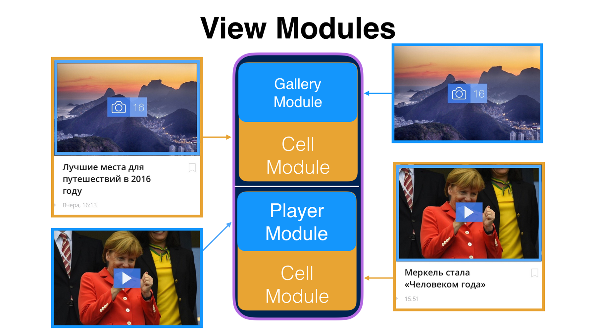
Самый очевидный способ - модуль View. Такой подход хорошо интегрируется с другими вариантами. Например, у нас может быть модуль ячейки, внутри которой есть подмодуль галереи или видео плеера. Такие подмодули могут быть легко переиспользуемы на других экранах.

## Когда подмодули помогают?
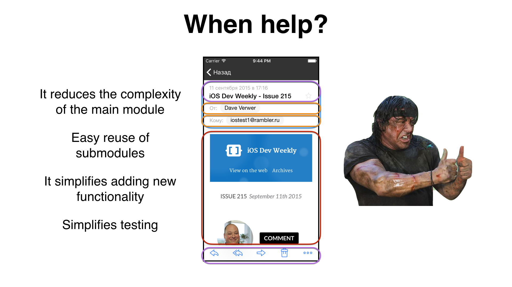
- Уменьшает сложность основного модуля
- Легкое переиспользование подмодулей
- Упрощает добавление новой функциональности
- Упрощает тестирование

## Когда подмодули мешают?
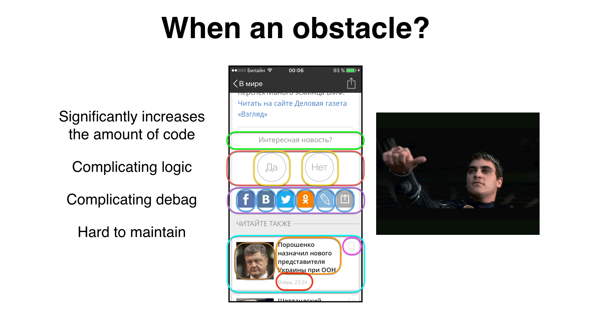
- Значительно увеличивает объем кода
- Усложняет логику
- Усложняет отладку
- Тяжело поддерживать
