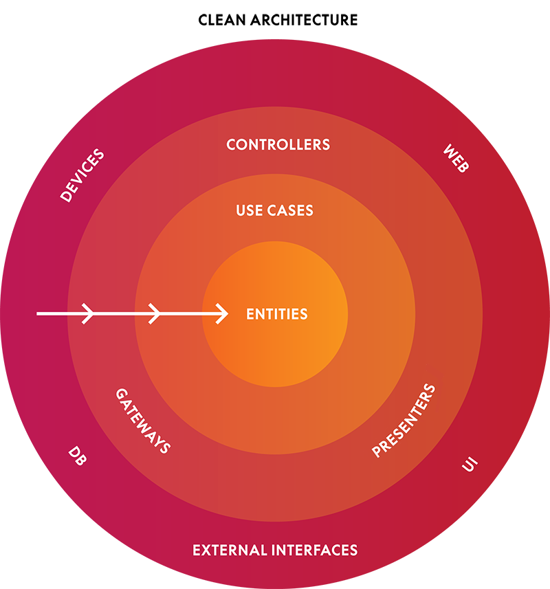

**VIPER** - это подход к архитектуре мобильных приложений (в частности - iOS), основанный на идеях [Роберта Мартина](http://blog.cleancoder.com/), изложенных им в статье [The Clean Architecture](https://blog.8thlight.com/uncle-bob/2012/08/13/the-clean-architecture.html).

#### Основные задачи, которые помогает решить VIPER

- Обеспечение более полного покрытия тестами слоя Presentation, обычно включающего в себя *Massive View Controllers*.
- Разбитие самых крупных классов наших приложений на набор элементов с более-менее четко определенными границами ответственности.

Важно сразу же отметить, что VIPER - это ни в коем случае не набор строгих шаблонов и правил. Скорее это перечень рекомендаций, следуя которым можно построить гибкую и переиспользуемую архитектуру мобильного приложения. Мы, iOS команда Rambler&Co, адаптировали некоторые из каноничных принципов и сформировали определенный набор Best Practices для разработки тех или иных юзкейсов.

Первоначально VIPER может ломать сознание, особенно разработчикам без опыта командной работы над крупными проектами - отсутствует понимание необходимости независимости модулей приложения друг от друга и максимально возможного покрытия их тестами. Тем не менее, весь набор решений оправдывает себя даже для небольших приложений.

#### Основные достоинства и недостатки VIPER

Плюсы:

- Повышение тестируемости Presentation-слоя приложений.
- Полная независимость модулей друг от друга - это позволяет независимо их разрабатывать и переиспользовать как в одном приложении, так и в нескольких.
- Передача проекта другим разработчикам, либо внедрение нового, дается намного проще, так как общие подходы к архитектуре заренее определены.

Минусы:

- Резкое увеличение количества классов в проекте, сложности при создании нового модуля.
- Некоторые из принципов не ложатся напрямую на UIKit и подходы Apple.
- Отсутствие в открытом доступе набора конкретных рекомендаций, best practices и примеров сложных приложений.

Остальные части нашего руководства в подробностях раскроют каждый из этих пунктов, в том числе расскажут о том, как избавиться от перечисленных недостатков.

#### Небольшой ликбез по истории вопроса

- **08.2012** - Статья [The Clean Architecture](https://blog.8thlight.com/uncle-bob/2012/08/13/the-clean-architecture.html) от Роберта Мартина.
- **12.2013** - Статья [Introduction to VIPER](http://mutualmobile.github.io/blog/2013/12/04/viper-introduction/) от компании [MutualMobile](http://mutualmobile.github.io/).
- **06.2014** - Выпуск objc.io #13 со статьей [Architecting iOS Apps with VIPER](https://www.objc.io/issues/13-architecture/viper/) от тех же MutualMobile.
- **07.2014** - [Выпуск подкаста iPhreaks Show](https://itunes.apple.com/ru/podcast/the-iphreaks-show/id634022060?mt=2&i=316803444), в котором MutualMobile рассказывают о том, как появился VIPER, какие вопросы он решает, и как используется в их приложениях.
- **04.2015** - В рамках локального хакатона в Rambler&Co пишется первое приложение с использованием подходов VIPER.
- **12.2015** - У Rambler&Co больше десяти приложений на VIPER, как разрабатываемых в данный момент, так и [выпущенных в AppStore](https://itunes.apple.com/ru/developer/rambler-internet-holdings/id395455934).