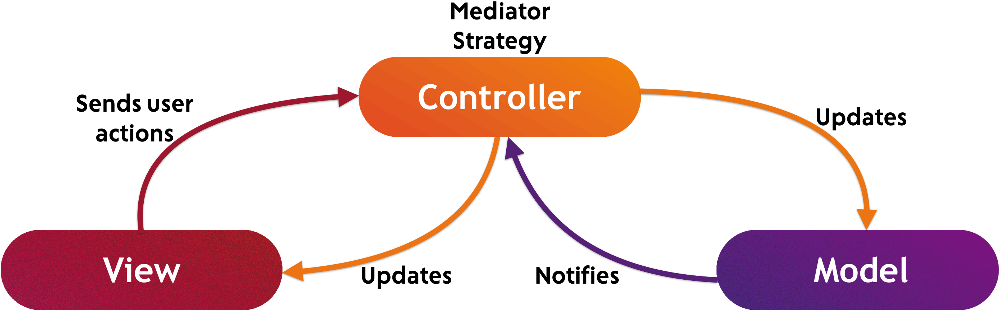
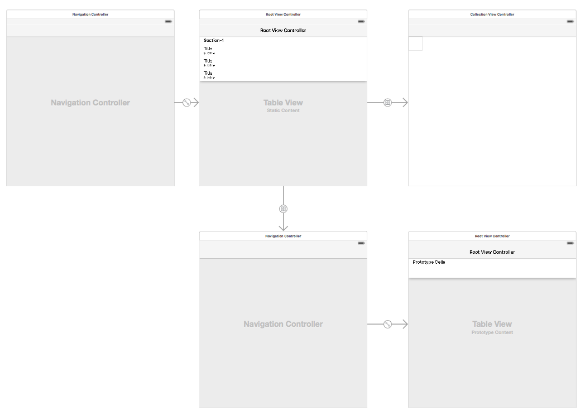
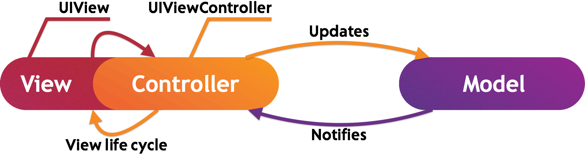
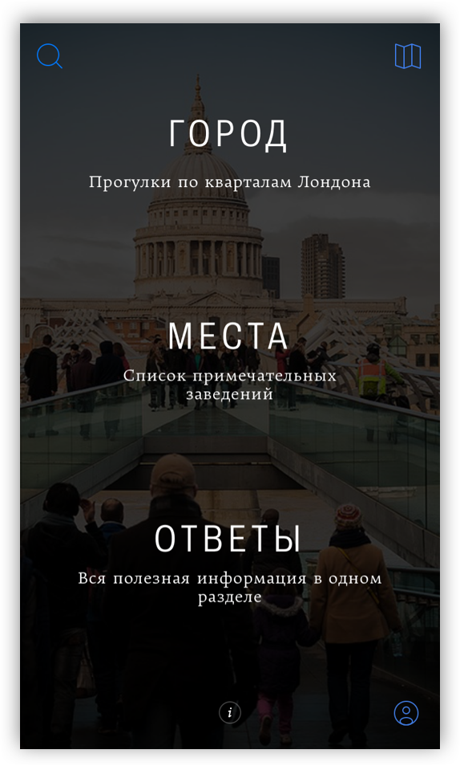
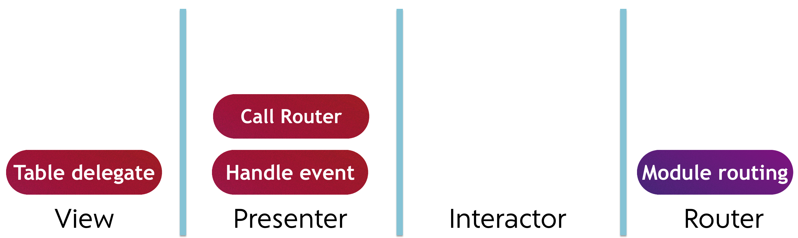
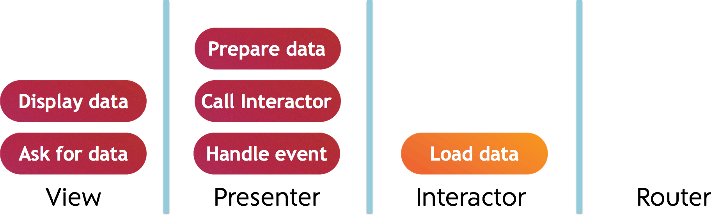
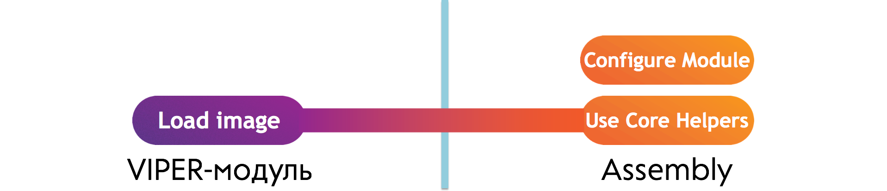

Начать новый проект, заложив в его основу VIPER-архитектуру, несложно. Но программисты в своей практике постоянно сталкиваются с задачей поддержки и развития приложений, чья кодовая база изначально разрабатывалась хаотично, без применения жестких правил проектирования. Часто бывает, что требований к первой версии проекта немного, они умещаются на одном тетрадном листе, и, соответственно, при разработке не уделяется должное внимание архитектуре приложения. А техническое задание ко второй версии получается не менее объемным, чем "Война и мир" Толстого, что, естественно, требует кардинально изменить подход к развитию проекта. Поэтому более сложной, но и более интересной задачей является миграция уже в какой-то степени готового iOS-приложения со слабым фундаментом на прочное основание гибкой и надежной архитектуры, которой является VIPER.   

### Почему MVC становится Massive-View-Controller

Базовый архитектурный шаблон iOS-приложений, предлагаемый Apple, - это **Model-View-Controller (MVC, "модель-представление-контроллер")**. Обычно этому паттерну явно или неявно следуют все начинающие разработчики. Шаблон Model-View-Controller, что очевидно, - трехслойный. При его использовании все объекты приложения в зависимости от своего назначения принадлежат одному из трех слоев: модели (Model), представлению (View) или управлению (Controller). Каждый архитектурный слой отделен от другого абстрактными границами, через которые осуществляется связь между объектами разных слоев. Основная цель применения этой архитектурной концепции состоит в отделении бизнес-логики (модели) от её визуализации (представления). 

**Модельный слой** описывает данные приложения и определяет логику их обработки и хранения. Объекты модели не должны иметь явной связи с объектами представления; они не содержат информации, как данные можно визуализировать. Примерами объектов этого слоя являются объекты хранения данных, парсеры, сетевые клиенты и т.д. 

**Слой представления** содержит объекты, которые пользователь может увидеть. Чаще всего, объекты этого слоя переиспользуемы. К ним относятся, например, **UILabel** и **UIButton**.

**Слой управления** выступает посредником при взаимодействии объектов слоя представления и модельных объектов: контролирует ввод данных пользователем и использует модель и представление для реализации необходимой реакции. Также объекты этого слоя выполняют постановку и согласование задач приложения, управление жизненным циклом других объектов. 



> **Замечание**. Несмотря на то, что в своей документации Apple называет описываемый архитектурный шаблон классическим Model-View-Controller, его правильное название - **Model–View–Adapter (MVA, "модель-представление-адаптер")** или **mediating-controller Model-View-Controller**. 
> 
> MVA и MVC решают одну и ту же проблему, но используют разный подход. Классический MVC представляется в виде треугольника, где вершинами являются слои: модель, представление и управление, - и разрешает обмен данными между моделью и представлением в обход контроллера. MVA же располагает три слоя на одной линии, исключая прямой обмен данными между моделью и представлением (как на рисунке выше). 
> 
> В статье здесь и дальше будет использоваться название Model-View-Controller для исключения расхождений с официальной документацией компании Apple. 

Согласно рекомендаций Apple, ядром слоя управления в iOS-приложении выступают **контроллеры представления (view controllers)**. Каждый такой объект отвечает за

* управление иерархией представлений;
* адаптацию размеров представлений к определяемому устройством пространству отображения; 
* обновление содержимого представлений в ответ на изменение данных;
* обработку пользовательского ввода и передачу полученных данных в модельный слой;
* освобождение связанных ресурсов при нехватке доступной оперативной памяти. 

Рекомендуемым способом описания view controller и связанных с ним view является **Storyboard editor**. Используя этот инструмент, можно не только указать, какие объекты представления какому view controller принадлежат, но также определить иерархические связи и переходы между различными контроллерами. 

Apple дает несколько советов по созданию контроллеров представления.

* **Используйте поставляемые со стандартным SDK классы view controllers.**

    В iOS SDK имеется множество контроллеров представления, решающих конкретные задачи: от доступа к списку контактов пользователя до отображения медиаданных. Хорошей практикой является использование в своих приложениях таких, поставляемых системными библиотеками, контроллеров. 

* **Создавайте view controller максимально автономным.**   

    Контроллер представления не должен знать о внутренней логике другого контроллера или о его иерархии view. Обмен данными между двумя контроллерами должен осуществляться через явно определенный публичный интерфейс. 

* **Не храните во view controller данные.** 
    
    View controller выступает посредником между модельным слоем и слоем представления при обмене данными. Он может кешировать некоторые данные для быстрого доступа, валидировать их, но его основная обязанность - гарантировать, что view отображает правильную информацию.    

* **Используйте view controller для реакции на внешние события.**
    
    К внешним событиям относятся: пользовательский ввод, системные уведомления (например, о появлении клавиатуры), делегатные методы различных обработчиков (например, [CLLocationManager](https://developer.apple.com/library/ios/documentation/CoreLocation/Reference/CLLocationManager_Class/index.html#//apple_ref/doc/uid/TP40007125-CH3)).      

Приведенные рекомендации и советы, несмотря на свою полезность, слишком общие, описаны без конкретизации и поэтому имеют ряд недостатков. Главный из них - неконтролируемый рост сложности контроллеров представления. Их неразрывная связь с жизненным циклом представлений, являющаяся особенностью iOS SDK, требует формировать реакции на события этого цикла непосредственно во view controller. Реализация обработки внешних событий, пользовательского ввода также происходит во view controller. Помимо этого, модель часто становится слишком пассивной, используется исключительно для доступа к данным, а вся бизнес-логика оказывается вновь во view controller. Отдельно стоит отметить, что Apple практически не рассматривает важные вопросы организации двунаправленной передачи данных между контроллерами, конфигурации созданных контроллеров и т.п., что приводит большинство разработчиков к выводу, что за них опять же ответственен view controller.  

В итоге, контроллеры представления становятся центром практически всего, что происходит в приложении и, как следствие, разрастаются до гигантских размеров, превращаясь в то, что называется **Massive-** или **Mega-View-Controller**. Подобный объект является отличным примером последствий необдуманной разработки, игнорирующей базовые принципы проектирования. 



Можно выделить следующие недостатки Massive-View-Controller. 

* **Высокая сложность поддержки и развития.** 
    
    Код в Massive-View-Controller сложно модифицировать и расширять из-за его высокой связности и неочевидных потоков данных. Существует риск, что при внесении изменений можно сломать текущую функциональность приложения и до определенного момента не замечать этого. 

* **Высокий порог вхождения.**
    
    Найти в большом объеме кода нужный метод может оказаться непростой задачей: структура кода неявна и требует время на изучение. 

* **Код слабо тестируем.**
    
    Из-за высокой связности код Massive-View-Controller не покрывается модульными тестами. Так, попытка проверить логику представления приводит к явному вызову методов жизненного цикла, которые неявно могут повлечь за собой загрузку всех связанных view, что нарушает принципы unit-тестирования.    

* **Код практически невозможно переиспользовать.**
    
    Реализация новой функциональности приложения происходит непосредственно в контроллере представления. Соответственно, переиспользовать этот код без переиспользования всего контроллера не представляется возможным, а рефакторинг и декомпозиция объемного объекта может оказаться нетривиальной задачей. 

Чтобы избежать перечисленных недостатков и не загнать в тупик разработку приложения, необходимо строго следовать требованиям хорошего, продуманного архитектурного шаблона. Model-View-Controller, несмотря на слабые места и неочевидность решения некоторых задач проектирования, вследствие простоты использования подойдет для небольших приложений или приложений, требующих высокую скорость разработки. Но для крупных и сложных, с долговременным циклом поддержки и развития лучше использовать более гибкую архитектуру - VIPER. 

### От плохой реализации к хорошей. Рефакторинг Massive-View-Controller

Столкнувшись с задачей развития приложения, код которого отягчен Massive-View-Controller, прежде всего необходимо улучшить структуру проекта. Как следствие, требуется миграция большого и трудноподдерживаемого Massive-View-Controller во что-то более удобное и гибкое, например, VIPER-модуль. 
В VIPER, в отличие от MVC, контроллер представления выступает ядром view-слоя, что позволяет не нагружать его дополнительной логикой и локализовать в нем только реализацию задач, непосредственно связанных с визуализацией данных. В этом случае view controller, получая различные внешние сигналы (пользовательский ввод, системные уведомления о нехватке памяти и т.д.), передает их на обработку нижележащему слою - презентеру. Вся остальная невизуальная логика модуля, реализуемая в MVC непосредственно во view controller (например, создание других модулей или передача данных между ними), также инкапуслирована в других слоях. 

Ниже приведено три примера перехода от Massive-View-Controller к VIPER-модулю. В качестве исходной используется реализация контроллера представления из реального проекта - гида по одному из городов мира. В выбранном в качестве примера view controller реализовано главное навигационное меню.



#### Примеры рефакторинга

* **Переход между модулями**

    В данном коде реализуется переход во внутренний раздел приложения. Направление перехода определяется по индексу выбранной ячейки таблицы меню. 
    
    ```objective-c
    - (void)tableView:(UITableView *)tableView didSelectRowAtIndexPath:(NSIndexPath *)indexPath {
        long index = indexPath.row;
        switch (index) {
            case MainMenuCellsCity: {
                UIStoryboard *sb = [TyphoonStoryboard storyboardWithName:@"Quarters"
                                                                 factory:AGAppDelegateMacros.storyboardFactory
                                                                  bundle:nil];
                UIViewController *vc = [sb instantiateViewControllerWithIdentifier:@"agquarterslistviewcontroller"];
                [self.navigationController pushViewController:vc
                                                     animated:YES];
            }
            break;
            case MainMenuCellsPlaces: {
                UIStoryboard *sb = [TyphoonStoryboard storyboardWithName:@"Places"
                                                                 factory:AGAppDelegateMacros.storyboardFactory
                                                                  bundle:nil];
                UIViewController *vc = [sb instantiateViewControllerWithIdentifier:@"agplacescategorieslist"];
                [self.navigationController pushViewController:vc
                                                     animated:YES];
            }
            break;
            case MainMenuCellsReferenceBook: {
                UIStoryboard *sb = [TyphoonStoryboard storyboardWithName:@"ReferenceBook"
                                                                 factory:AGAppDelegateMacros.storyboardFactory
                                                                  bundle:nil];
                UIViewController *vc = [sb instantiateViewControllerWithIdentifier:@"agreferencebookcategoriesviewcontroller"];
                [self.navigationController pushViewController:vc
                                                     animated:YES];
            }
            break;
        }
    }
    ```

    Эта реализация имеет ряд проблем.
    
    * Слой представления нагружен дополнительной логикой по созданию новых модулей и реализацию переходов между ними. 
    * При добавлении новых пунктов меню приведенный метод будет неограниченно разрастаться и может затронуть текущую реализацию. 
    * Код тяжело покрывается модульными тестами. 

    Поэтому при рефакторинге рассматриваемый код следует перенести в другие слои. Для этого
    
    1. Необходимо расширить протокол выходных данных view-слоя. 
       
       Следует добавить метод **«Покажи раздел меню указанного типа, перейдя с исходного view controller»**
       
       ```objective-c
       @protocol AGMainMenuControllerViewOutput <NSObject>

        @required
        - (void)showMenuSectionWithType:(MainMenuSectionType)sectionType
                     fromViewController:(UIViewController *)viewController;
        
        @end
       ```
       
    2. Провести рефакторинг исходного метода из контроллера представления. 

       ```objective-c
       - (void)tableView:(UITableView *)tableView didSelectRowAtIndexPath:(NSIndexPath *)indexPath {
            NSInteger index = indexPath.row;
            [self.output showMenuSectionWithType:index
                              fromViewController:self];
        }
       ```
       Теперь контроллер представления передает обработку пользовательского ввода из view-слоя в презентер, не делая ничего лишнего. 
       
    3. Расширить протокол входных данных для роутера формируемого VIPER-модуля. 

       На каждый из трех исходных переходов следует определить свой метод. 
      
      ```objective-c
      @protocol AGMainMenuRouterInput <NSObject>

      @required
      - (void)showCityFromViewController:(UIViewController *)viewController;
      - (void)showPlacesFromViewController:(UIViewController *)viewController;
      - (void)showReferenceBookFromViewController:(UIViewController *)viewController;
        
      @end
      ```
      
    4. Реализовать добавленные методы протокола выходных данных view-слоя в презентере. 

       Получив от слоя представления данные пользовательского ввода (т.е. номер выбранной ячейки таблицы), презентер выбирает вариант перехода и передает  управление роутеру. 
       
       ```objective-c
       - (void)showMenuSectionWithType:(MainMenuSectionType)sectionType
                     fromViewController:(UIViewController *)viewController {
            switch (sectionType) {
                case MainMenuCellsCity:
                    [self.router showCityFromViewController:viewController];
                    break;
                case MainMenuCellsPlaces:
                    [self.router showPlacesFromViewController:viewController];
                    break;
                case MainMenuCellsReferenceBook:
                    [self.router showReferenceBookFromViewController:viewController];
                    break;
            }
        }
       ```
       
    5. Реализовать добавленные в протоколе методы в роутере формируемого VIPER-модуля.

       В каждом из реализуемых методов требуется загружать из фабрики нужный сториборд, из него получать следующий view controller и выполнять переход. 
       
       ```objective-c
        - (void)showCityFromViewController:(UIViewController *)viewController {
            UIStoryboard *sb = [TyphoonStoryboard storyboardWithName:@"Quarters"
                                                             factory:AGAppDelegateMacros.storyboardFactory
                                                              bundle:nil];
            UIViewController *vc = [sb instantiateViewControllerWithIdentifier:@"agquarterslistviewcontroller"];
            [viewController.navigationController pushViewController:vc animated:YES];
        }
        
        - (void)showPlacesFromViewController:(UIViewController *)viewController {
            UIStoryboard *sb = [TyphoonStoryboard storyboardWithName:@"Places"
                                                             factory:AGAppDelegateMacros.storyboardFactory
                                                              bundle:nil];
            UIViewController *vc = [sb instantiateViewControllerWithIdentifier:@"agplacescategorieslist"];
            [viewController.navigationController pushViewController:vc animated:YES];
        }
        
        - (void)showReferenceBookFromViewController:(UIViewController *)viewController {
            UIStoryboard *sb = [TyphoonStoryboard storyboardWithName:@"ReferenceBook"
                                                             factory:AGAppDelegateMacros.storyboardFactory
                                                              bundle:nil];
            UIViewController *vc = [sb instantiateViewControllerWithIdentifier:@"agreferencebookcategoriesviewcontroller"];
            [viewController.navigationController pushViewController:vc animated:YES];
        }
       ```

    В итоге, такая реализация исходной задачи сделает код менее связным (например, можно заменить реализацию роутера и обработать переходы по-другому), тестируемым и более читаемым. Дальнейший рефакторинг кода из рассматриваемого примера, несмотря на свою необходимость, не затронет распределение логики по слоям VIPER-модуля. 
    
    Результаты распределения логики по слоям VIPER-модуля представлены на рисунке ниже. 
    
    

* **Чтение данных**

    В этом примере в методе **viewDidLoad** рассматриваемого контроллера представления реализована загрузка списка кварталов города из локальной базы (для загрузки используется библиотека [MagicalRecord](https://github.com/magicalpanda/MagicalRecord)). При этом после загрузки на обработку передаются managed objects, что может привести к непредсказуемому поведению приложения в дальнейшем. 
    
    ```objective-c
    - (void)viewDidLoad {
        [super viewDidLoad];
    
        NSManagedObjectContext *context = [NSManagedObjectContext MR_defaultContext];
        NSString *sortTerm = NSStringFromSelector(@selector(priority));
        NSArray *quarters = [AGQuarter MR_findAllSortedBy:sortTerm ascending:YES inContext:context];
        [self handleLoadedQuarters:quarters];
    }
    ```
    
    При рефакторинге следует вынести логику чтения данных из view-слоя. Для этого
    
    1. Необходимо добавить новый метод к выходным данным view-слоя.

       Это будет **«Получить список кварталов»**.

       ```objective-c
       @protocol AGMainMenuControllerViewOutput <NSObject>
        
       @required
       - (void)obtainQuarters;
        
       @end
       ``` 
       
    2. Провести рефакторинг исходного метода из контроллера представления. 

       ```objective-c
       - (void)viewDidLoad {
            [super viewDidLoad];
            [self.output obtainQuarters];
       }
       ```
       Теперь контроллер представления передает управление презентеру, избавляясь от несвойственной ему логики.
       
    3. Реализовать добавленный в протоколе метод в презентере формируемого VIPER-модуля. 

       ```objective-c
       - (void)obtainQuarters {
            [self.view showSpinners];
            [self.interactor loadQuarters];
       }
       ```
       Презентер модуля передает запрос данных на обработку интерактору, предварительно изменив состояние view-слоя. Для этого презентер использует протокол входных данных view-слоя и просит отобразить индикатор загрузки. 
       
    4. Реализовать загрузку данных в интеракторе. 
 
       ```objective-c
       - (void)loadQuarters {
           NSManagedObjectContext *context = [NSManagedObjectContext MR_defaultContext];
           NSString *sortTerm = NSStringFromSelector(@selector(priority));
           NSArray *quarters = [AGQuarter MR_findAllSortedBy:sortTerm
                                                   ascending:YES
                                                   inContext:context];
           NSArray *ponsoQuarters = [self createPlainObjectsFrom:quarters];
           [self.output loadedQuarters:ponsoQuarters];
       }
       ```
       Необходимо загрузить данные из базы, а затем на основе полученных managed-объектов создать «плоские» модели (**PONSO, Plain Old NSObject**), которые не нагружены дополнительными возможностями и предсказуемо ведут себя при работе в потоках. 
        
    5. Передать полученные презентером данные на отображение. 

       ```objective-c
       - (void)loadedQuarters:(NSArray *)quarters {
            [self.view hideSpinners];
            [self.view handleObtainedQuarters:quarters];
       }
       ``` 
       Презентер просит view-слой скрыть индикаторы загрузки и обработать полученные данные. 
       
    6. Отобразить полученные данные. 

       ```objective-c
       - (void)handleObtainedQuarters:(NSArray *)quarters {
            // Displaying quarters
       }
       ``` 
       Непосредственная реализация в рамках примера не рассматривается. 
       
    В итоге, полученная реализация исправит потенциальную ошибку, связанную с использованием managed-объектов во view-слое, уменьшит связность кода и повысит его тестируемость.
    
    Результаты распределения логики по слоям VIPER-модуля представлены на рисунке ниже. 
    
     
    
* **Конфигурация объектов**

   В этом примере менеджер локального кеша изображений лениво создается в геттере, определенном непосредственно во view controller. 
   
   ```objective-c
   - (id<AGImageLocalCacheManager>)imageLocalCacheManager {
        if (_imageLocalCacheManager == nil) {
            NSFileManager *fileManager = [NSFileManager defaultManager];
            _imageLocalCacheManager = [AGImageLocalCacheManagerImplementation cacheManagerWithFileManager:fileManager];
        }
        return _imageLocalCacheManager;
   }
   ```
   
   Но объект сам не должен создавать требуемые ему вспомогательные объекты - это чревато дублированием кода по настройке зависимостей. Поэтому для инкапсуляции этой логики используются специальные конфигураторы, для реализации которых можно использовать готовые DI-фреймворки, например, [Typhoon](https://github.com/appsquickly/Typhoon). Тогда при рефакторинге кода этого примера необходимо сделать следующее. 
   
   1. Перенести менеджер кеша на уровень интерактора, так как взаимодействие с локальным хранилищем - это его ответственность, а не view-слоя. 

      ```objective-c
      @interface AGMainMenuInteractor : NSObject <AGMainMenuInteractorInput>

      @property (nonatomic, strong) id<AGImageLocalCacheManager> imageLocalCacheManager;
    
      @end
      ``` 
      
      Интерактор модуля будет строгой ссылкой держать менеджер кеша.
      
    2. Вынести настройку зависимостей объектов модуля в отдельный объект - assembly. 

      ```objective-c
      @implementation AGMainMenuAssembly
      
      - (AGMainMenuInteractor *)interactorMainMenu {
            return [TyphoonDefinition withClass:[AGMainMenuInteractor class]
                                  configuration:^(TyphoonDefinition *definition) {
                                      [definition injectProperty:@selector(output)
                                                            with:[self presenterMainMenu]];
                                      [definition injectProperty:@selector(imageLocalCacheManager)
                                                            with:[self.coreHelpersAssembly imageLocalCacheManager]];
                                  }];
      }
      
      @end
      ```
      
      Так как менеджер кеша - это базовый компонент, переиспользуемый между различными модулями, хорошей практикой будет использовать для него и ему подобных сущностей отдельный конфигуратор. В примере это **coreHelpersAssembly**.
      
    3. Добавить создание менеджера кеша в assembly для базовых объектов. 

       ```objective-c
       @implementation AGCoreHelpersAssembly
       
       - (id<AGImageLocalCacheManager>)imageLocalCacheManager {
            return [TyphoonDefinition withClass:[AGImageLocalCacheManagerImplementation class]
                                  configuration:^(TyphoonDefinition *definition) {
                                      [definition useInitializer:@selector(cacheManagerWithFileManager:)
                                                      parameters:^(TyphoonMethod *initializer) {
                                                          [initializer injectParameterWith:[self fileManager]];
                                                      }];
                                  }];
        }
       
       @end
       ```
       
    В итоге, интерактор сможет использовать менеджер кеша и передавать полученные от него данные вышележащим слоям.
    
    ```objective-c
    - (void)loadBackgroundImage {
        AGPaperGuide *guide = [AGPaperGuide MR_findFirstInContext:[NSManagedObjectContext MR_defaultContext]];
        UIImage *guideBackgroundImage = [self.imageLocalCacheManager loadImageWithImageId:guide.backgroundImage.photoId];
        [self.output loadedBackgroundImage:guideBackgroundImage];
    }
    ```
    
    Полученная реализация устраняет потенциальное дублирование при создании вспомогательных объектов и повышает тестируемость кода.
    
    Результаты распределения логики по слоям VIPER-модуля представлены на рисунке ниже. 
    
      

#### Общие советы, полезные при переходе от Massive-View-Controller к VIPER-модулю

Ниже приведено несколько советов, полезных при переходе от Massive-View-Controller к VIPER-модулю. 

* Воспринимайте view в VIPER-модуле не как объект, а как слой, в котором есть множество объектов. Например, хорошим тоном будет создание в этом слое отдельных объектов, реализующих делегаты таблицы и большинство других протоколов. Также стоит использовать вспомогательные сущности для анимаций. 
* Классы, зависимые от **UIKit**, **Core Animation** или **Core Graphics** не должны выходить за пределы view-слоя.
* Используйте во view для взаимодействия с данными простые неизменяемые объекты, реализация которых никак не связана с модельным слоем. Это гарантирует, что данные, отданные во view для отображения, уже загружены и могут быть отображены. 
* Сложные view, являющиеся частью иерархии view controller, должны сами реализовывать логику своего отображения. Так, кастомный date picker с дополнительными свойствами для визуализации данных может быть определен в отдельном вспомогательном классе. 
* Если view controller содержит очень много свойств даже после рефакторинга, стоит получившийся VIPER-модуль разбить на несколько. 

#### Результаты рефакторинга    

О правильности проведенного рефакторинга может свидетельствовать простой опросник, на все вопросы которого необходимо ответить: "Нет". 

* Взаимодействует ли view controller напрямую с моделью?
* Содержит ли view controller бизнес-логику?
* Содержит ли view controller логику, не связанную с UI?

В среднем на рефакторинг одного Massive-View-Controller с учетом написания тестов уходит 2-3 рабочих дня в зависимости от опыта и квалификации разработчика. При этом после трансформации исходной реализации в VIPER-модуль решаются обозначенные выше недостатки массивного контроллера и значительно повышается понимание потоков данных и управления приложения за счет структуризации кода. 

Стоит отметить, что необязательно переводить все view controller проекта в VIPER-модули. Об этом необходимо задумываться, например, в тот момент, когда MVC становится трудно покрываем тестами или затрудняется переиспользование логики между классами. Это возможно, так как VIPER полностью совместим с Model-View-Controller. Т.е. внутри одного проекта могут быть как контроллеры, написанные по MVC и потенциально ожидающие рефакторинга, так и VIPER-модули.

### Дополнительное чтение

* [Wikipedia: Model-View-Controller](https://ru.wikipedia.org/wiki/Model-View-Controller). 
* [Wikipedia: Model-View-Adapter](https://en.wikipedia.org/wiki/Model-view-adapter). 
* [Apple's DevPedia: Model-View-Controller](https://developer.apple.com/library/ios/documentation/General/Conceptual/DevPedia-CocoaCore/MVC.html#//apple_ref/doc/uid/TP40008195-CH32). 
* [Apple's CocoaEncyclopedia: Model-View-Controller](https://developer.apple.com/library/ios/documentation/General/Conceptual/CocoaEncyclopedia/Model-View-Controller/Model-View-Controller.html).
* [Apple's documentation: UIViewController class reference](https://developer.apple.com/library/ios/documentation/UIKit/Reference/UIViewController_Class/index.html#//apple_ref/doc/uid/TP40006926). 
* [Apple's documentation: view controller for iOS](https://developer.apple.com/library/ios/featuredarticles/ViewControllerPGforiPhoneOS/index.html#//apple_ref/doc/uid/TP40007457).
* [Apple's documentation: view controller design tips](https://developer.apple.com/library/ios/featuredarticles/ViewControllerPGforiPhoneOS/DesignTips.html#//apple_ref/doc/uid/TP40007457-CH5-SW1). 
* [WWDC 2012/236. The evolution of View Controllers on iOS](https://developer.apple.com/videos/play/wwdc2012/236/).
* [WWDC 2014/229. Advanced iOS Application Architecture and Patterns](https://developer.apple.com/videos/play/wwdc2014/229/).
* [iOS architecture patterns by Bohdan Orlov](https://medium.com/ios-os-x-development/ios-architecture-patterns-ecba4c38de52). 
* [objc.io. Issue №1. Lighter view controllers](https://www.objc.io/issues/1-view-controllers/). 
* [Model-View-Controller (MVC) in iOS: A Modern Approach by Rui Peres](https://www.raywenderlich.com/132662/mvc-in-ios-a-modern-approach).
